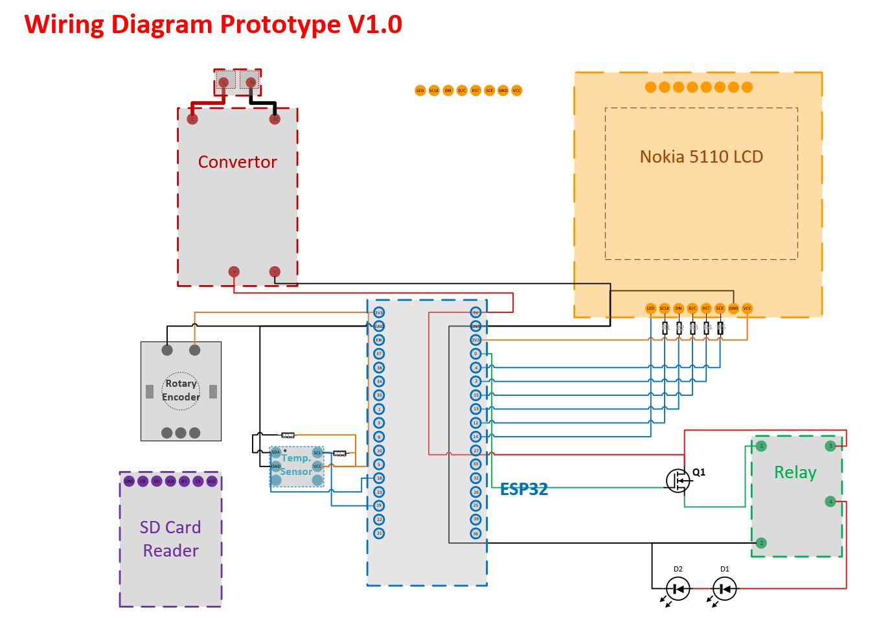

# EMS-Capstone-BCIT-2018-19

LDC_DHT --> first code to connect ESP to Nokia LCD and read the tempreture readings

HomeSweetHome-Web-pages-V1.0 --> first version of the website for "ecosuite.xyz" to attach to Heruko server


Here are the wiring diagram details for the first prototype amde. The code is in C (arduino) and it will be converted to Python code.
"Wiring diagram Prototype 1"

 


The python code will also have a user interface to navigate through the devices settings.


Next step for the project is to create a Network of ESPs, to communicated and collect data on the master's SD card.


 

```html
<h2>Example of code</h2>

<pre>
    <div class="container">
        <div class="block two first">
            <h2>Your title</h2>
            <div class="wrap">
            //Your content
            </div>
        </div>
    </div>
</pre>
```
